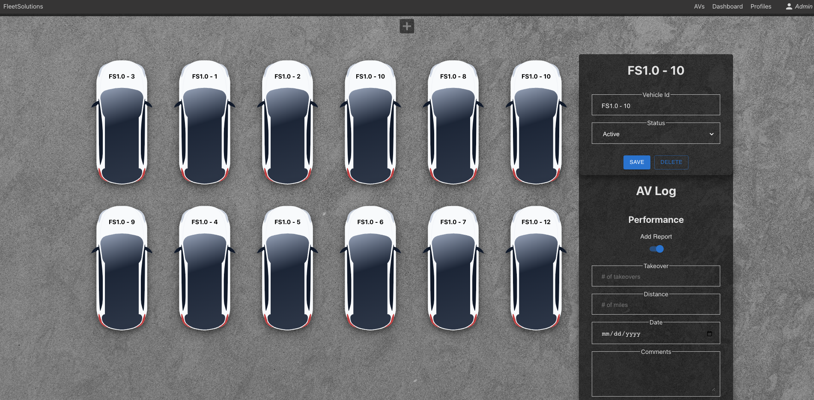

# Fleet Solutions

## Click **[Here](https://fleet-solutions.netlify.app/)** to use the app

**Fleet Solutions** was inspired by my previous role with an autonomous driving technology company. I wanted to create a fleetOps and finance solution that will help both departments to manage their workflows. The platform allows users to track parts and labor costs for maintenance, and the total amount miles and takeovers from any given drive.

**Fleet Solutions** will provide the data needed to make key budget and forecasting decisions, as well as understand the progression of the SDS over time. 

Planning materials and original wireframes can be found [here](https://trello.com/b/vkUT9dft/fleet-solutions).

## Technologies Used:
* TypeScript (frontend)
* Javascript (backend)
* Recharts.js
* React.js
* Express.js
* Node.js
* Sequelize
* PostgresSQL
* JWT Authentication
* Javascript
* HTML
* CSS
* Git
* Recharts
* MUI
* Netlify
* Fly.io

## Credits
* Charts by [Rechart](https://recharts.org/en-US/examples/SimpleLineChart)
* Vehicle image by [Edmunds](https://static.ed.edmunds-media.com/unversioned/img/self-driving-cars/car.svg)
* Landing page image by [Unsplash](https://unsplash.com/s/photos/concrete)
* Icons by [flaticon](https://www.flaticon.com/)

## Ice Box
- [ ] Allow users to search for an AV by it's vehicle Id # in the AVs and Dashboard pages
- [ ] Allow users to filter the dashboard by Month, Year, YTD
- [ ] Allow admins to deactivate accounts, preventing users to sign-in, in order to maintain data history
- [ ] Implement role dashboard views
- [ ] Implement safety incident model and dashboard
- [ ] Implement a more robust analytical reporting 
- [ ] Implement drag and drop functionality to the AVs page

